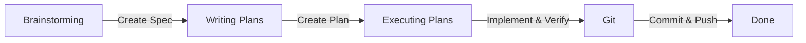

# Agent Skills Framework

This repository defines a structured, modular set of agent instructions, rules, and capability modules (skills) designed to guide agentic workflows through the software development lifecycle. By following this framework, autonomous AI coding assistants can maintain consistent quality, adhere to codebase conventions, and execute tasks safely.

---

## Directory Structure

The framework is organized under the `.agents/` directory:

```text
.agents/
├── context/       # High-level context for project orientation
├── rules/         # Coding standards, architectural and design guidelines
└── skills/        # Workflow stages and executable task guides
```

### 1. Context (`.agents/context/`)

Contains background information to orient the agent to the domain, terms, and boundaries:

- `project-overview.md` — Explains the purpose, target users, boundaries, and system flow.
- `glossary.md` — Defines domain terms and project-specific language.
- `architecture-overview.md` — Orients the agent to modules, services, and ownership boundaries.

### 2. Rules (`.agents/rules/`)

Mandatory instructions defining the quality standards and architectural guidelines for code changes:

- `coding-style.md` — Rules for formatting, conventions, and language features.
- `architecture.md` — Boundary constraints, patterns, and component structures.
- `api-design.md` — REST API endpoint conventions, naming, versioning, and error envelopes.
- `database.md` — Prisma migrations, indexing, naming conventions, and data ownership rules.
- `security.md` — Input validation guidelines, secret-handling constraints, and cryptographic policies.
- `testing.md` — Test structure, vitest mocking guidelines, and isolation policies.
- `documentation.md` — Requirements for maintaining official developer documents.

### 3. Skills (`.agents/skills/`)

Matching capability folders for specific workflow stages. Each folder contains a `SKILL.md` that defines constraints, checklists, and processes:

| Skill               | Folder / Path      | Purpose & Usage                                                                                                                                    |
| :------------------ | :----------------- | :------------------------------------------------------------------------------------------------------------------------------------------------- |
| **Brainstorming**   | `brainstorming/`   | Designing features, components, behavior changes, and resolving design decisions. Outputs an approved spec to `docs/specs/`.                       |
| **Writing Plans**   | `writing-plans/`   | Translating approved specifications into actionable implementation plans. Outputs a plan to `docs/plans/`.                                         |
| **Executing Plans** | `executing-plans/` | Implementing changes step-by-step from an approved plan. Focuses on execution and local verification.                                              |
| **Fix**             | `fix/`             | Resolving bugs, regressions, failing tests, compilation/lint errors, or broken behaviors.                                                          |
| **Git**             | `git/`             | Formatting, inspecting, staging, and committing changes. Performs safety checks before prompting for push approval.                                |
| **Loop**            | `loop/`            | Iterative debugging and verification cycles when multiple failures or flaky tests require repeated assessment.                                     |
| **Docs**            | `docs/`            | Creating or updating official codebase documentation (`docs/architecture.md`, `docs/api.md`, `docs/database.md`) based on implementation evidence. |

---

## Workflow Workflow Stage Progression

For any feature development or major change, agents progress sequentially through the matching workflow skills:



### Safety and Quality Gates

- **Zero-Touch Rules**: During plan writing or brainstorming, agents must never modify application files.
- **Verification Requirement**: Work is only considered complete once the aggregate verification command (`npm run verify`) passes cleanly.
- **Double-Approval**: Major changes require plan approval before execution, and commit validation before remote push.
